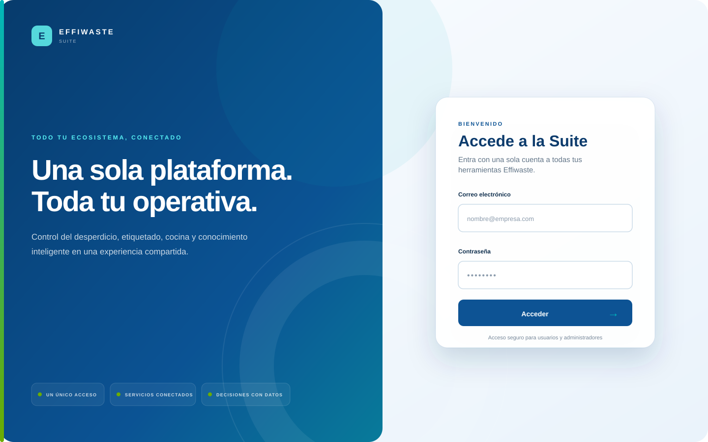
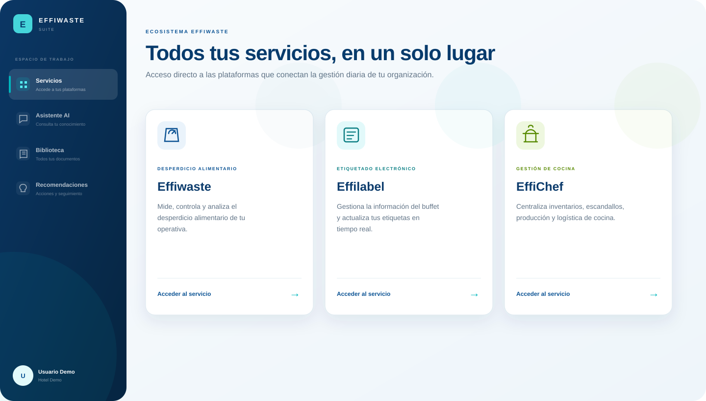
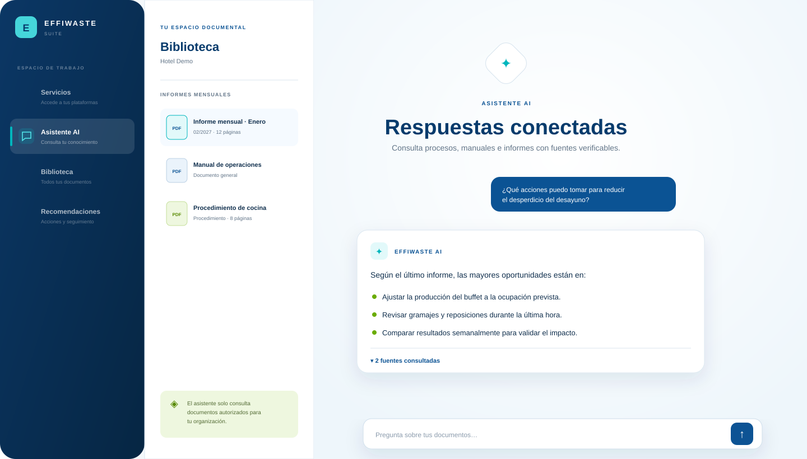
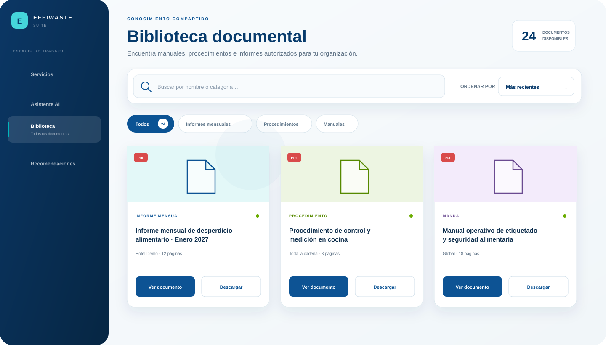
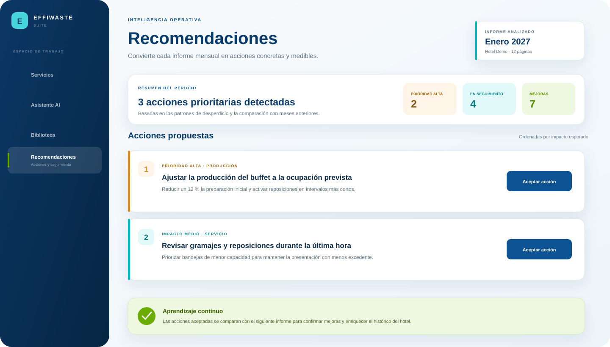

# Effiwaste Suite · Client Portal

### Un único espacio para conectar servicios, conocimiento y decisiones operativas.

Plataforma multiempresa para organizaciones hoteleras que reúne el ecosistema Effiwaste, un asistente documental con IA, una biblioteca segura y recomendaciones accionables basadas en informes reales.

## Una plataforma, toda la operativa

Effiwaste Suite ofrece a cada organización un punto de acceso común a sus herramientas y su conocimiento. La experiencia está diseñada para que usuarios, hoteles, cadenas y administradores trabajen desde un entorno coherente, seguro y adaptado a sus permisos.

| | Funcionalidad | Valor |
|---|---|---|
| 🌐 | **Ecosistema conectado** | Acceso centralizado a Effiwaste, Effilabel y EffiChef. |
| ✦ | **Asistente RAG** | Respuestas generadas únicamente a partir de documentación autorizada. |
| 📚 | **Biblioteca documental** | Manuales, procedimientos e informes organizados y fáciles de localizar. |
| 💡 | **Recomendaciones** | Acciones concretas derivadas del análisis de informes mensuales. |
| 🏨 | **Entorno multiempresa** | Permisos diferenciados para contenido global, cadenas y hoteles. |
| ✓ | **Seguimiento de mejoras** | Evaluación continua de las acciones aceptadas en periodos posteriores. |

## Ecosistema Effiwaste

El portal conecta los principales servicios de la organización bajo una misma identidad y una navegación unificada.

- **Effiwaste** — medición, control y análisis del desperdicio alimentario.
- **Effilabel** — gestión del etiquetado electrónico y actualización de la información del buffet.
- **EffiChef** — inventarios, escandallos, producción y logística de cocina.

## Conocimiento que responde

El asistente RAG convierte la documentación interna en respuestas claras y contextualizadas. Cada consulta respeta el ámbito de acceso del usuario y mantiene la trazabilidad hacia las fuentes originales.

### Respuestas fiables por diseño

- Recuperación híbrida mediante búsqueda semántica y textual.
- Respuestas acompañadas de referencias al documento y la página de origen.
- Separación automática del conocimiento global, de cadena y de hotel.
- Interpretación de texto, tablas, gráficas, imágenes y documentos escaneados.
- Contenido recuperado tratado como información no confiable para reducir riesgos de *prompt injection*.

## Biblioteca documental

Toda la documentación autorizada se presenta en una biblioteca visual, con búsqueda, ordenación y filtros por categoría. Los usuarios pueden consultar o descargar los documentos originales sin abandonar su espacio de trabajo.

La biblioteca diferencia entre:

- informes mensuales;
- procedimientos operativos;
- manuales;
- documentación general.

Cada documento conserva su audiencia, categoría, periodo, número de páginas y estado de procesamiento.

## De los informes a la acción

Los informes mensuales no se limitan a almacenarse. La plataforma los analiza para proponer medidas concretas de reducción del desperdicio, priorizadas según su impacto esperado.

El ciclo de mejora conecta cada periodo con el siguiente:

1. El informe mensual se procesa y se incorpora al conocimiento del hotel.
2. La IA identifica oportunidades y genera acciones específicas.
3. El usuario revisa y acepta las medidas relevantes.
4. El siguiente informe permite comprobar si la acción produjo una mejora.
5. Los resultados confirmados enriquecen la biblioteca de buenas prácticas del hotel.

## Experiencias por perfil

| Usuario de hotel | Administrador |
|---|---|
| Accede a los servicios de la Suite. | Gestiona cadenas, hoteles y usuarios. |
| Consulta el asistente con su documentación autorizada. | Publica documentos para toda la plataforma o audiencias concretas. |
| Explora informes, manuales y procedimientos. | Supervisa el procesamiento y puede reintentar ingestas fallidas. |
| Revisa, acepta y sigue recomendaciones. | Mantiene la estructura documental y los permisos de acceso. |

## Seguridad y privacidad

- Contraseñas protegidas mediante **Argon2**.
- Sesiones firmadas y operaciones de escritura protegidas con **CSRF**.
- Control de acceso aplicado antes de recuperar cualquier fragmento documental.
- Validación de archivos PDF, límites de tamaño y rechazo de documentos cifrados.
- Procesamiento de IA configurado sin almacenamiento de las respuestas enviadas al proveedor.
- Aislamiento de la información por organización, cadena y hotel.

## Tecnología

El proyecto combina **FastAPI**, **PostgreSQL + pgvector**, **Redis**, **Celery** y modelos de **OpenAI** para ofrecer autenticación, procesamiento documental multimodal, búsqueda híbrida, respuestas con fuentes y generación de recomendaciones.

---

  <strong>Effiwaste Suite</strong> 
  Conocimiento conectado para una operativa más eficiente.

