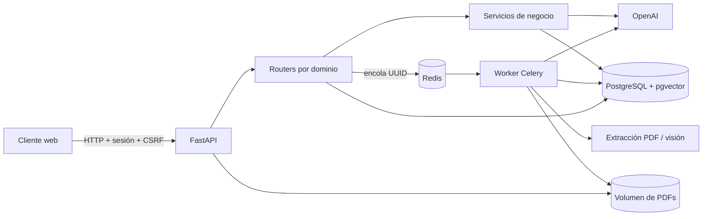
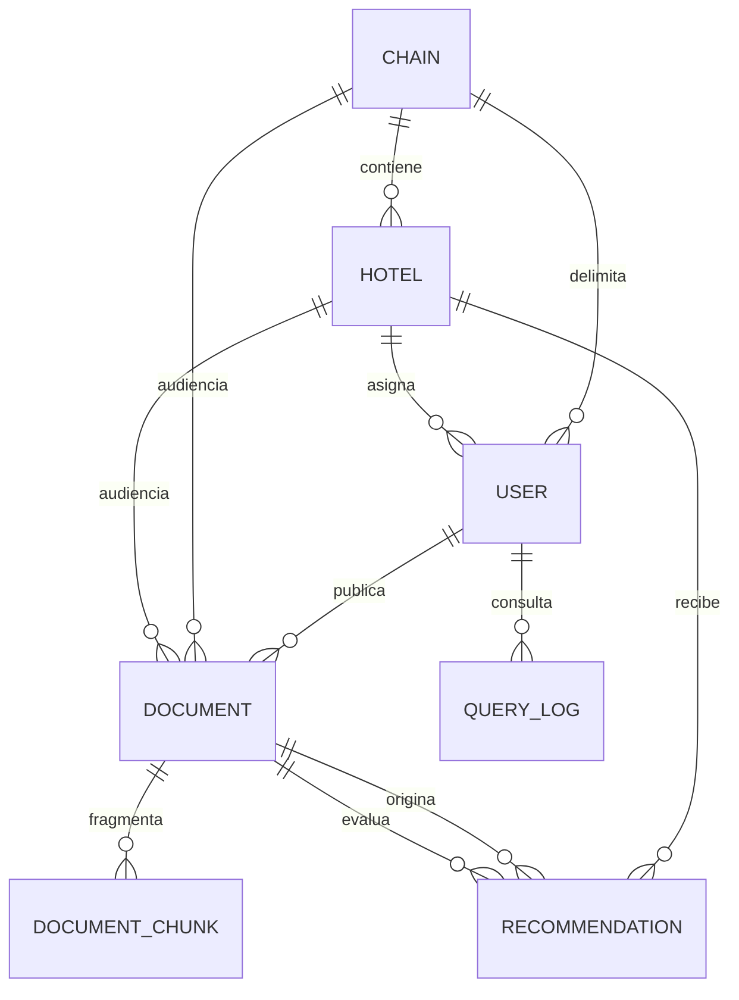

# Guía del código

Este documento explica cómo está organizada Effiwaste Suite, qué responsabilidad tiene cada módulo y cómo circula la información. La idea central es sencilla: las rutas HTTP coordinan, los servicios contienen la lógica, los modelos protegen la persistencia y el worker ejecuta el trabajo costoso fuera del proceso web.

## Arquitectura

El proceso web nunca extrae páginas ni calcula embeddings. Recibe la subida, valida lo imprescindible, guarda los metadatos y entrega el identificador al worker. Así una ingesta lenta no bloquea las peticiones de otros usuarios.

## Mapa de módulos

| Ruta | Responsabilidad |
|---|---|
| `app/main.py` | Construcción de la aplicación, ciclo de vida, middleware y registro de routers. No contiene reglas de negocio. |
| `app/config.py` | Configuración tipada. Rechaza un arranque de producción con secretos, cookies o credenciales de desarrollo. |
| `app/database.py` | Motor SQLAlchemy, sesiones por petición y preparación compatible del esquema. |
| `app/models.py` | Entidades, relaciones, índices vectoriales/textuales e invariantes de documentos. |
| `app/security.py` | Hash Argon2, verificación de login con coste uniforme, política de contraseña y tokens CSRF. |
| `app/web.py` | Usuario de sesión, autorización, CSRF, redirecciones internas y normalización de nombres. |
| `app/middleware.py` | Cabeceras de seguridad del navegador y HSTS cuando HTTPS está activado. |
| `app/schemas.py` | Contratos Pydantic de entrada para endpoints JSON. |
| `app/constants.py` | Catálogos compartidos por rutas y plantillas. |
| `app/bootstrap.py` | Inicialización del almacenamiento y cuentas iniciales sin sobrescribir contraseñas existentes. |
| `app/routers/public.py` | Salud, portada, login y logout. |
| `app/routers/workspace.py` | Asistente, biblioteca, servicios, recomendaciones y entrega autorizada de PDFs. |
| `app/routers/admin.py` | Administración de cadenas, hoteles, usuarios y documentos. |
| `app/services/access.py` | Única definición del alcance global, cadena y hotel, tanto en SQL como en memoria. |
| `app/services/login_limiter.py` | Protección distribuida del login mediante contadores seudonimizados en Redis. |
| `app/services/storage.py` | Resolución segura de nombres internos UUID dentro del volumen de subidas. |
| `app/services/pdf_service.py` | Firma y límites del PDF, extracción nativa/visual y fragmentación por tokens. |
| `app/services/openai_service.py` | Única frontera con OpenAI; timeouts, prompts defensivos y validación estructurada. |
| `app/services/rag_service.py` | Recuperación híbrida, fusión de rankings, respuesta con fuentes y auditoría. |
| `app/services/recommendation_service.py` | Propuestas mensuales, aceptación previa, evaluación y sustitución de propuestas antiguas. |
| `app/services/markdown_service.py` | Conversión de Markdown a una lista permitida de HTML seguro. |
| `app/worker.py` | Tarea idempotente de ingesta y su configuración de entrega, timeout y reintento operativo. |
| `app/templates/` | Vistas Jinja; no toman decisiones de autorización. |
| `app/static/app.js` | Mejora progresiva de UI. La seguridad no depende del navegador. |
| `tests/test_core.py` | Pruebas unitarias de reglas de acceso, validación, seguridad y transformación. |

## Modelo de datos

- `Document` conserva el PDF, su hash SHA-256, audiencia, categoría y estado.
- `DocumentChunk` guarda texto, posición, vector y un `tsvector` generado por PostgreSQL.
- `QueryLog` registra pregunta, respuesta y número de fuentes. Su política de conservación debe definirse en cada despliegue.
- `Recommendation` mantiene el ciclo completo: propuesta, aceptación, resultado y documento que aporta la evaluación.

Los documentos tienen restricciones en base de datos: un documento global no puede llevar hotel o cadena; uno de cadena exige cadena; uno de hotel exige ambas claves; y un informe mensual debe pertenecer a un hotel y tener periodo.

## Flujos principales

### Autenticación

1. `GET /login` crea un token CSRF ligado a la sesión firmada.
2. `POST /auth/login` valida CSRF, normaliza el correo y consulta los límites de Redis.
3. Se verifica siempre un hash Argon2, incluso si el correo no existe, para reducir enumeración temporal.
4. Un acceso correcto limpia la sesión anterior, crea un CSRF nuevo y guarda únicamente el UUID del usuario.
5. Cada petición autenticada vuelve a cargar el usuario y exige que siga activo.

### Subida e ingesta documental

1. El router administrativo verifica rol y CSRF.
2. La audiencia se resuelve contra cadenas/hoteles existentes.
3. El archivo se escribe con un UUID, nunca con el nombre aportado por el navegador.
4. Se controla tamaño durante el streaming, firma `%PDF-`, número de páginas y cifrado.
5. Solo después de validar se crea `Document` y se encola su UUID.
6. El worker vuelve a validar el archivo, extrae cada página, usa visión cuando detecta contenido visual y divide por tokens.
7. Los embeddings se generan por lotes; una transacción reemplaza los fragmentos anteriores y marca el documento como listo.
8. Si es un informe mensual, se activa el ciclo de recomendaciones.

La doble validación del PDF es deliberada: protege tanto el borde HTTP como una tarea reintentada o invocada de forma independiente.

### Consulta RAG

1. `ChatRequest` elimina espacios y limita la pregunta a 2.000 caracteres.
2. `document_access_filter` se aplica antes de cualquier búsqueda; un fragmento no autorizado nunca entra en los candidatos.
3. Se ejecutan una búsqueda vectorial por distancia coseno y una búsqueda léxica en español.
4. Reciprocal Rank Fusion combina ambas listas sin mezclar escalas incompatibles.
5. Solo los mejores fragmentos llegan al modelo, que recibe instrucciones de tratar los documentos como datos no confiables.
6. La respuesta exige citas `[n]`; el servidor sanea su Markdown antes de que el navegador lo inserte como HTML.
7. Pregunta, respuesta y número de fuentes quedan auditados.

### Recomendaciones

Solo el informe mensual más reciente de un hotel puede producir propuestas activas. Una fila bloqueada con `FOR UPDATE` evita dos actualizaciones simultáneas. Antes de generar o evaluar, una barrera determinista comprueba que el archivo contiene cobertura mensual real de desperdicio; una receta o un procedimiento clasificados por error como informe mensual no pueden producir mejoras ni demostrar resultados.

Para evaluar una acción se recuperan fragmentos relevantes del informe que la originó y se comparan con el informe posterior. Existen tres resultados:

- `successful`: hay una reducción numérica comparable, o el desperdicio deja de aparecer en un análisis completo y equivalente de categorías;
- `discarded`: una medición comparable demuestra que no bajó o que empeoró;
- `inconclusive`: falta cobertura, el documento no es comparable o la evidencia no supera las reglas deterministas. La acción continúa activa, pero la interfaz explica que ya fue revisada sin evidencia suficiente.

La ausencia por sí sola no equivale a éxito. Solo cuenta cuando el informe posterior cubre de forma amplia el mismo ámbito, la evidencia inicial demuestra el problema y el modelo identifica el apartado completo en el que ya no aparece. Las salidas se validan con Pydantic y las comparaciones numéricas vuelven a comprobarse en código, incluyendo unidades y dirección de la mejora.

Las propuestas anteriores pendientes pasan a `superseded` cuando existe un conjunto nuevo válido. Las propuestas procedentes de un documento sin cobertura mensual suficiente también se retiran como fuente no válida.

## Invariantes que no deben romperse

- Toda consulta o descarga documental debe pasar por `document_access_filter` o `can_access_document`.
- Una ruta mutadora autenticada debe verificar CSRF antes de cambiar estado.
- El navegador nunca decide permisos; ocultar un botón no sustituye una comprobación del servidor.
- `original_name` es solo descriptivo. El acceso al disco usa exclusivamente `stored_name`, validado como UUID PDF.
- El contenido de documentos y las respuestas del modelo son datos no confiables.
- Una salida de IA no se persiste hasta superar un esquema cerrado.
- Los errores técnicos completos van al log; la interfaz recibe mensajes acotados.
- Un arranque no rota ni reemplaza contraseñas existentes.

## Configuración

`Settings` lee variables de entorno y aplica límites de tipo y rango. Los grupos principales son:

| Grupo | Variables relevantes |
|---|---|
| Entorno web | `ENVIRONMENT`, `SESSION_SECRET`, `COOKIE_SECURE`, `SESSION_MAX_AGE_SECONDS`, `ALLOWED_HOSTS` |
| Autenticación | `LOGIN_MAX_ATTEMPTS`, `LOGIN_IP_MAX_ATTEMPTS`, `LOGIN_WINDOW_SECONDS` |
| Datos | `DATABASE_URL`, `REDIS_URL`, `UPLOAD_DIR` |
| Documentos | `MAX_UPLOAD_MB`, `MAX_PDF_PAGES` |
| Centro de ayuda | `SUPPORT_EMAIL`, `SMTP_HOST`, `SMTP_PORT`, credenciales y opciones TLS, límites de adjuntos |
| IA | `OPENAI_API_KEY`, modelos, dimensiones y parámetros de recuperación |
| Arranque | credenciales iniciales y `SEED_DEMO_DATA` |

En producción, la configuración falla de forma explícita si detecta el secreto o la contraseña inicial, cookies sin `Secure`, datos demo, credenciales de base de datos de desarrollo, hosts abiertos o ausencia de clave de OpenAI.

## Criterios para ampliar el proyecto

Al añadir una funcionalidad:

1. Define primero el contrato de entrada y los límites.
2. Coloca la autorización lo más cerca posible de la consulta a datos.
3. Mantén el router como coordinador; extrae lógica reutilizable a `services`.
4. Conserva operaciones relacionadas dentro de una transacción.
5. Añade una prueba positiva y al menos una prueba de rechazo.
6. Documenta cualquier dato personal nuevo, su destino y su conservación.
7. Si cambia el esquema, crea una migración versionada para producción; `create_all` solo sirve para instalaciones nuevas y las alteraciones actuales cubren compatibilidad histórica limitada.
